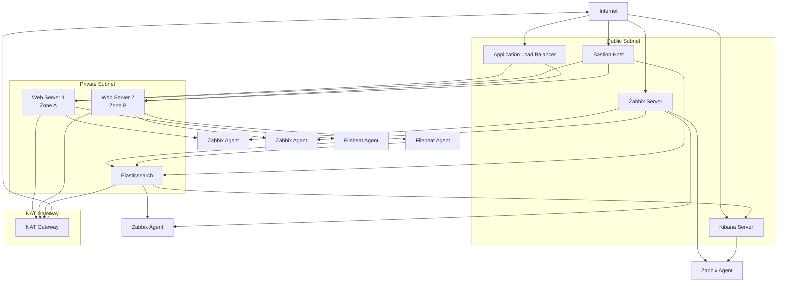

# Design Document: Yandex Cloud Infrastructure

## Overview

This document describes the design for a fault-tolerant web infrastructure in Yandex Cloud. The system consists of multiple layers: web servers with load balancing, monitoring with Zabbix, centralized logging with ELK stack, and comprehensive backup solutions. The infrastructure follows security best practices with network segmentation, bastion host access, and proper security groups configuration.

The architecture emphasizes high availability through multi-zone deployment, automated monitoring and alerting, centralized log management, and automated backup procedures. All components are deployed using Infrastructure as Code principles with Terraform for provisioning and Ansible for configuration management.

## Architecture

### High-Level Architecture



### Network Architecture

The infrastructure uses a single VPC with segmented subnets:

**Public Subnet (10.0.1.0/24)**:
- Application Load Balancer
- Bastion Host
- Zabbix Server
- Kibana Server

**Private Subnet (10.0.2.0/24)**:
- Web Servers (nginx)
- Elasticsearch Server

**NAT Gateway**: Provides outbound internet access for private subnet resources.

### Security Architecture

**Security Groups Configuration**:
- **ALB Security Group**: Allows HTTP (80) from internet
- **Bastion Security Group**: Allows SSH (22) from internet
- **Web Servers Security Group**: Allows HTTP (80) from ALB, SSH (22) from Bastion
- **Monitoring Security Group**: Allows Zabbix ports (10050, 10051) from Zabbix server
- **ELK Security Group**: Allows Elasticsearch (9200), Kibana (5601) from authorized sources
- **Internal Security Group**: Allows all traffic between internal resources

## Components and Interfaces

### Web Layer

**Web Servers**:
- **Technology**: nginx on Ubuntu 20.04 LTS
- **Deployment**: Two VMs in different availability zones (ru-central1-a, ru-central1-b)
- **Configuration**: Identical static content, no external IP addresses
- **Health Checks**: HTTP GET on port 80, path "/"

**Application Load Balancer**:
- **Type**: Yandex Cloud Application Load Balancer (L7)
- **Configuration**: 
  - Target Group with both web servers
  - Backend Group with health checks
  - HTTP Router for path routing
  - Listener on port 80

### Monitoring Layer

**Zabbix Server**:
- **Technology**: Zabbix 6.0 LTS
- **Database**: PostgreSQL (local installation)
- **Web Interface**: Apache/nginx frontend
- **Agents**: Installed on all VMs

**Monitoring Metrics**:
- **USE Methodology**:
  - **Utilization**: CPU usage, memory usage, disk usage, network bandwidth
  - **Saturation**: Load average, memory pressure, disk I/O wait
  - **Errors**: HTTP error rates, system errors, network errors

**Dashboards and Alerts**:
- System overview dashboard
- Web server performance dashboard
- Infrastructure health dashboard
- Threshold-based alerting for critical metrics

### Logging Layer

**Elasticsearch**:
- **Version**: 8.x
- **Configuration**: Single-node deployment with appropriate JVM settings
- **Storage**: Persistent disk with adequate space for log retention
- **Security**: Basic authentication enabled

**Kibana**:
- **Version**: 8.x (matching Elasticsearch)
- **Configuration**: Connected to Elasticsearch cluster
- **Access**: Web interface on port 5601

**Filebeat Agents**:
- **Deployment**: Installed on all web servers
- **Configuration**: Collects nginx access.log and error.log
- **Output**: Direct to Elasticsearch

### Infrastructure Layer

**Bastion Host**:
- **Purpose**: Secure access point for private resources
- **Configuration**: SSH key authentication only, minimal services
- **Access**: SSH ProxyCommand or direct Ansible execution

**NAT Gateway**:
- **Purpose**: Outbound internet access for private subnet
- **Configuration**: Yandex Cloud managed NAT Gateway
- **Routing**: Default route for private subnet traffic

## Data Models

### Terraform State Structure

```hcl
# VPC and Network Resources
resource "yandex_vpc_network" "main"
resource "yandex_vpc_subnet" "public"
resource "yandex_vpc_subnet" "private"
resource "yandex_vpc_gateway" "nat_gateway"
resource "yandex_vpc_route_table" "private"

# Security Groups
resource "yandex_vpc_security_group" "alb"
resource "yandex_vpc_security_group" "bastion"
resource "yandex_vpc_security_group" "web"
resource "yandex_vpc_security_group" "monitoring"
resource "yandex_vpc_security_group" "elk"

# Compute Resources
resource "yandex_compute_instance" "web_servers"
resource "yandex_compute_instance" "bastion"
resource "yandex_compute_instance" "zabbix"
resource "yandex_compute_instance" "elasticsearch"
resource "yandex_compute_instance" "kibana"

# Load Balancer Resources
resource "yandex_alb_target_group" "web"
resource "yandex_alb_backend_group" "web"
resource "yandex_alb_http_router" "main"
resource "yandex_alb_load_balancer" "main"

# Backup Resources
resource "yandex_compute_snapshot_schedule" "daily"
```

### Ansible Inventory Structure

```yaml
all:
  children:
    web_servers:
      hosts:
        web-1.ru-central1.internal:
        web-2.ru-central1.internal:
    monitoring:
      hosts:
        zabbix.ru-central1.internal:
    logging:
      hosts:
        elasticsearch.ru-central1.internal:
        kibana.ru-central1.internal:
    bastion:
      hosts:
        bastion.ru-central1.internal:
```

### Configuration Management Data

**Zabbix Configuration**:
- Host templates for different server types
- Item definitions for USE metrics
- Trigger definitions with appropriate thresholds
- Dashboard configurations

**ELK Configuration**:
- Elasticsearch index templates
- Kibana index patterns and visualizations
- Filebeat input configurations for nginx logs

## Correctness Properties

*A property is a characteristic or behavior that should hold true across all valid executions of a system-essentially, a formal statement about what the system should do. Properties serve as the bridge between human-readable specifications and machine-verifiable correctness guarantees.*

### Infrastructure Deployment Properties

**Property 1: FQDN Usage in Inventory**
*For any* Ansible inventory file, all host entries should use FQDN format (*.ru-central1.internal) and not contain IP addresses
**Validates: Requirements 1.3**

**Property 2: Minimal VM Configuration**
*For any* virtual machine in the infrastructure, the configuration should not exceed the specified limits (2 cores 20% Intel Ice Lake, 2-4GB RAM, 10GB HDD)
**Validates: Requirements 1.4**

**Property 3: Credential Security**
*For any* file in version control, it should not contain cloud authentication tokens, API keys, or other sensitive credentials
**Validates: Requirements 1.5, 8.1**

### Web Server Properties

**Property 4: Multi-Zone Web Server Deployment**
*For any* web server deployment, exactly two web servers should exist and they should be distributed across different availability zones
**Validates: Requirements 2.1, 9.1**

**Property 5: Nginx Service Availability**
*For any* web server VM, nginx service should be installed, configured, and running
**Validates: Requirements 2.2**

**Property 6: Content Consistency**
*For any* HTTP request to the same path, all web servers should return identical content
**Validates: Requirements 2.3**

**Property 7: Private Network Isolation**
*For any* web server VM, it should not have external IP addresses assigned and should be accessible only through authorized paths (load balancer or bastion host)
**Validates: Requirements 2.4, 2.5, 8.5**

### Load Balancer Properties

**Property 8: Target Group Configuration**
*For any* target group, it should contain exactly the web server VMs and no other resources
**Validates: Requirements 3.1**

**Property 9: Health Check Configuration**
*For any* backend group, it should have health checks configured for port 80 and path "/"
**Validates: Requirements 3.2**

**Property 10: HTTP Router Configuration**
*For any* HTTP router, it should have path "/" mapped to the correct backend group
**Validates: Requirements 3.3**

**Property 11: Load Balancer Listener Configuration**
*For any* Application Load Balancer, it should have an HTTP listener configured on port 80
**Validates: Requirements 3.4**

**Property 12: End-to-End Web Connectivity**
*For any* HTTP request to the load balancer public IP, it should return valid web content from available servers
**Validates: Requirements 3.5**

### Monitoring Properties

**Property 13: Zabbix Server Deployment**
*For any* monitoring infrastructure, Zabbix server should be installed and running on the designated VM
**Validates: Requirements 4.1**

**Property 14: Zabbix Agent Deployment**
*For any* VM in the infrastructure, it should have Zabbix agent installed and running
**Validates: Requirements 4.2**

**Property 15: USE Metrics Collection**
*For any* monitored system, USE metrics (Utilization, Saturation, Errors) should be collected for CPU, RAM, disk, and network
**Validates: Requirements 4.3**

**Property 16: HTTP Monitoring**
*For any* web server, HTTP request monitoring should be configured and collecting data
**Validates: Requirements 4.4**

**Property 17: Dashboard and Threshold Configuration**
*For any* monitoring system, dashboards should exist with appropriate threshold configurations for critical metrics
**Validates: Requirements 4.5**

### Logging Properties

**Property 18: Elasticsearch Deployment**
*For any* logging infrastructure, Elasticsearch should be installed and running on the designated VM
**Validates: Requirements 5.1**

**Property 19: Kibana Connectivity**
*For any* Kibana instance, it should be running and successfully connected to Elasticsearch
**Validates: Requirements 5.2**

**Property 20: Filebeat Agent Deployment**
*For any* web server VM, Filebeat should be installed and running
**Validates: Requirements 5.3**

**Property 21: Log Collection Functionality**
*For any* nginx log entry (access.log or error.log), it should be collected and stored in Elasticsearch
**Validates: Requirements 5.4**

**Property 22: Log Search Capability**
*For any* log entry in Elasticsearch, it should be searchable and analyzable through Kibana interface
**Validates: Requirements 5.5**

### Network Security Properties

**Property 23: VPC Resource Deployment**
*For any* infrastructure resource, it should be deployed within the single designated VPC
**Validates: Requirements 6.1**

**Property 24: Private Subnet Placement**
*For any* web server or Elasticsearch VM, it should be placed in private subnets
**Validates: Requirements 6.2**

**Property 25: Public Subnet Placement**
*For any* Zabbix, Kibana, or Load Balancer resource, it should be placed in public subnets
**Validates: Requirements 6.3**

**Property 26: Security Group Least Privilege**
*For any* security group, it should allow only the minimum necessary ports and protocols required for functionality
**Validates: Requirements 6.4, 8.3**

**Property 27: Bastion Host Security**
*For any* bastion host, it should have only SSH port (22) accessible from internet and should provide access to private resources
**Validates: Requirements 6.5**

**Property 28: NAT Gateway Connectivity**
*For any* private subnet VM, it should have internet access through the NAT Gateway
**Validates: Requirements 6.6**

### Backup Properties

**Property 29: Daily Snapshot Creation**
*For any* VM disk, daily snapshots should be created according to the configured schedule
**Validates: Requirements 7.1**

**Property 30: Snapshot Retention Policy**
*For any* snapshot older than one week, it should be automatically deleted
**Validates: Requirements 7.2, 7.4**

**Property 31: Snapshot Schedule Configuration**
*For any* backup system, snapshot schedules should be configured and active
**Validates: Requirements 7.3**

### Authentication and Security Properties

**Property 32: Service Account Authentication**
*For any* cloud authentication, it should use service accounts and key files rather than user credentials
**Validates: Requirements 8.2**

**Property 33: SSH Key Authentication**
*For any* server access, it should require SSH key authentication and disable password authentication
**Validates: Requirements 8.4**

### High Availability Properties

**Property 34: Health Check Failure Detection**
*For any* web server failure, the load balancer health checks should detect the failure and remove the server from rotation
**Validates: Requirements 9.2**

**Property 35: Failover Functionality**
*For any* single web server failure, the system should continue serving traffic from remaining healthy servers
**Validates: Requirements 9.3**

**Property 36: Recovery Functionality**
*For any* recovered web server, the load balancer should automatically restore traffic to the server when health checks pass
**Validates: Requirements 9.4**

### Operational Properties

**Property 37: Web Interface Accessibility**
*For any* web interface (main site, Kibana, Zabbix), it should be accessible and responding to requests
**Validates: Requirements 10.1**

## Error Handling

### Infrastructure Deployment Errors

**Terraform State Management**:
- State file corruption recovery procedures
- Resource drift detection and correction
- Dependency resolution for resource creation order

**Ansible Configuration Errors**:
- Idempotent playbook execution
- Connection failure handling through bastion host
- Service startup failure recovery

### Runtime Error Handling

**Load Balancer Health Checks**:
- Automatic unhealthy server removal
- Configurable health check intervals and thresholds
- Graceful degradation when all servers are unhealthy

**Monitoring System Errors**:
- Zabbix agent connection failures
- Metric collection interruptions
- Alert notification failures

**Logging System Errors**:
- Elasticsearch cluster health monitoring
- Filebeat connection retry mechanisms
- Log parsing error handling

### Security Error Handling

**Authentication Failures**:
- SSH key authentication failures
- Service account credential expiration
- Bastion host access violations

**Network Security Violations**:
- Security group rule violations
- Unauthorized access attempts
- Network connectivity failures

## Testing Strategy

### Dual Testing Approach

The testing strategy employs both unit tests and property-based tests to ensure comprehensive coverage:

**Unit Tests**: Focus on specific examples, edge cases, and error conditions
- Infrastructure component configuration validation
- Service installation and configuration verification
- Network connectivity testing for specific scenarios
- Security configuration validation

**Property-Based Tests**: Verify universal properties across all inputs
- Infrastructure consistency across all VMs
- Security group compliance across all resources
- Monitoring coverage across all services
- Backup functionality across all storage resources

### Property-Based Testing Configuration

**Testing Framework**: Terraform testing framework with Go-based property tests
**Test Iterations**: Minimum 100 iterations per property test
**Test Tagging**: Each property test references its design document property

**Tag Format**: `Feature: yandex-cloud-infrastructure, Property {number}: {property_text}`

### Test Categories

**Infrastructure Tests**:
- Resource provisioning validation
- Network topology verification
- Security group configuration testing
- Service deployment validation

**Functional Tests**:
- End-to-end web service functionality
- Monitoring system operation
- Logging system operation
- Backup system operation

**Security Tests**:
- Access control validation
- Network segmentation testing
- Authentication mechanism verification
- Credential security validation

**High Availability Tests**:
- Failover scenario testing
- Recovery procedure validation
- Load balancing functionality
- Multi-zone deployment verification

### Integration Testing

**Cross-Component Integration**:
- Web servers to load balancer integration
- Monitoring agents to Zabbix server integration
- Filebeat to Elasticsearch integration
- Bastion host to private resource access

**End-to-End Scenarios**:
- Complete user request flow through the system
- Monitoring alert generation and handling
- Log collection and analysis workflow
- Backup and recovery procedures

Each correctness property will be implemented as a single property-based test that validates the universal behavior across all relevant system components.