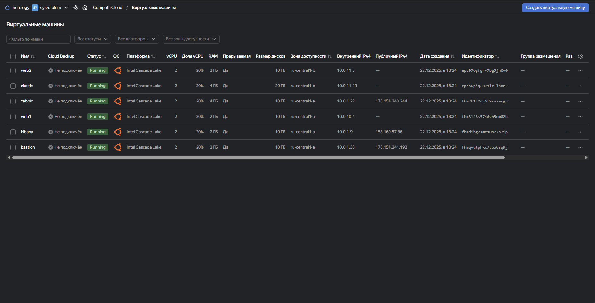
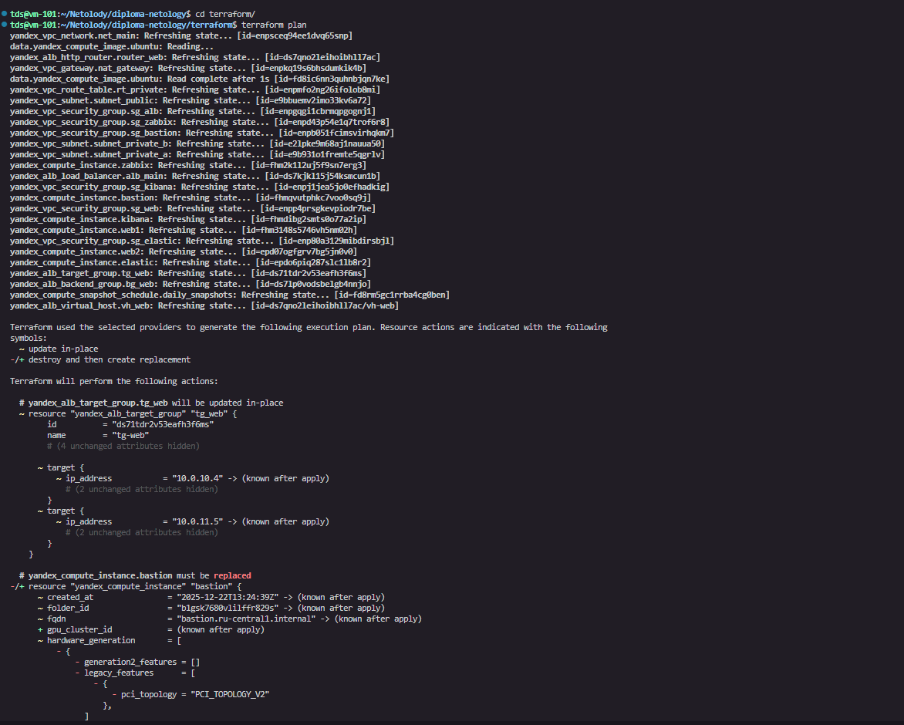
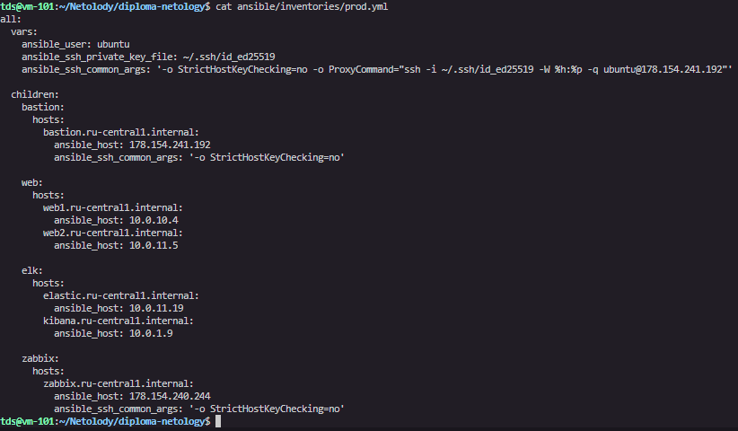
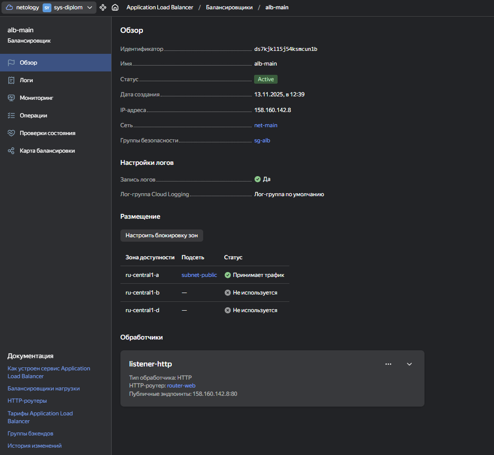
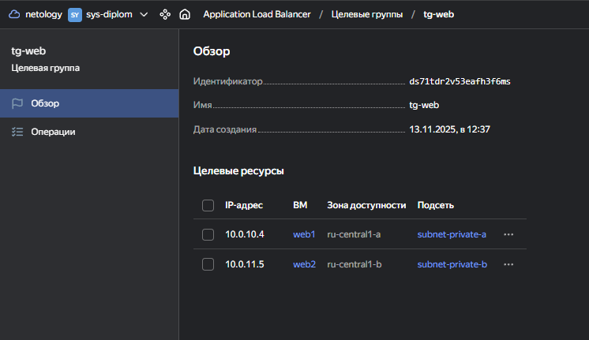
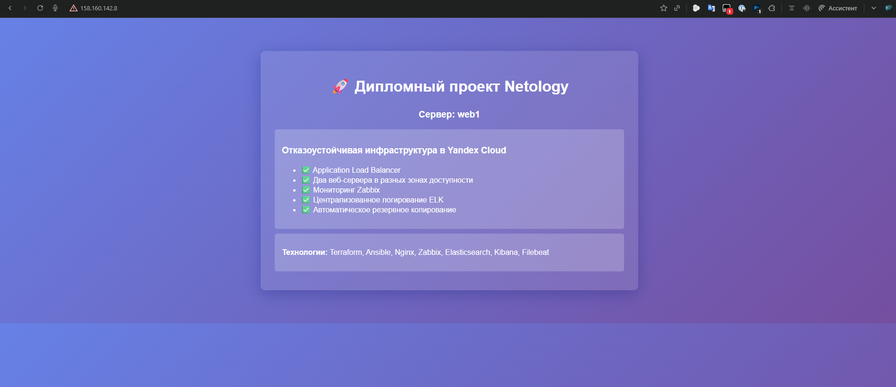
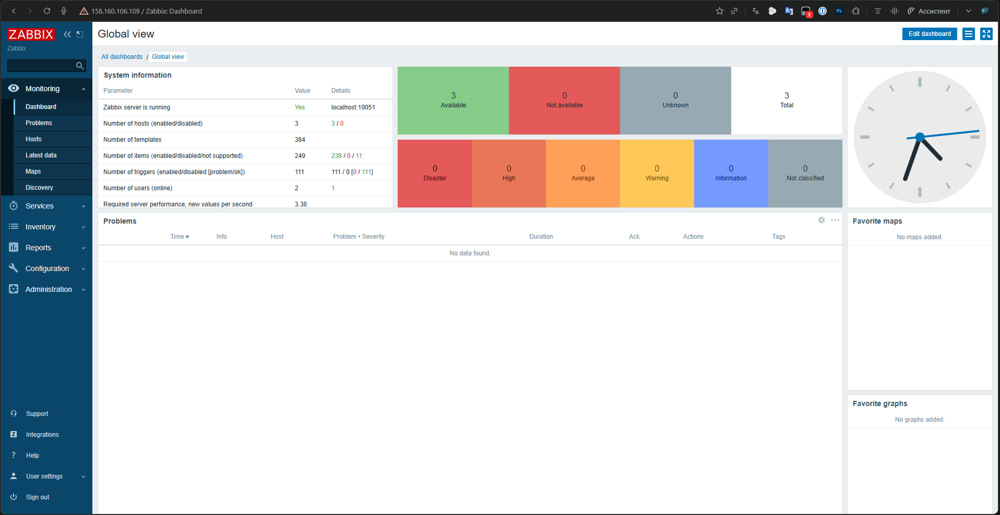
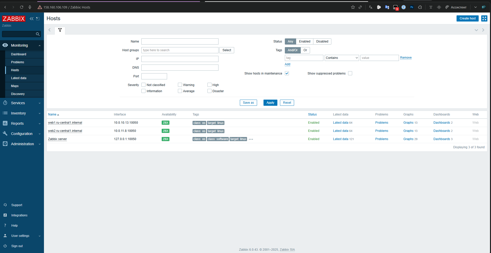
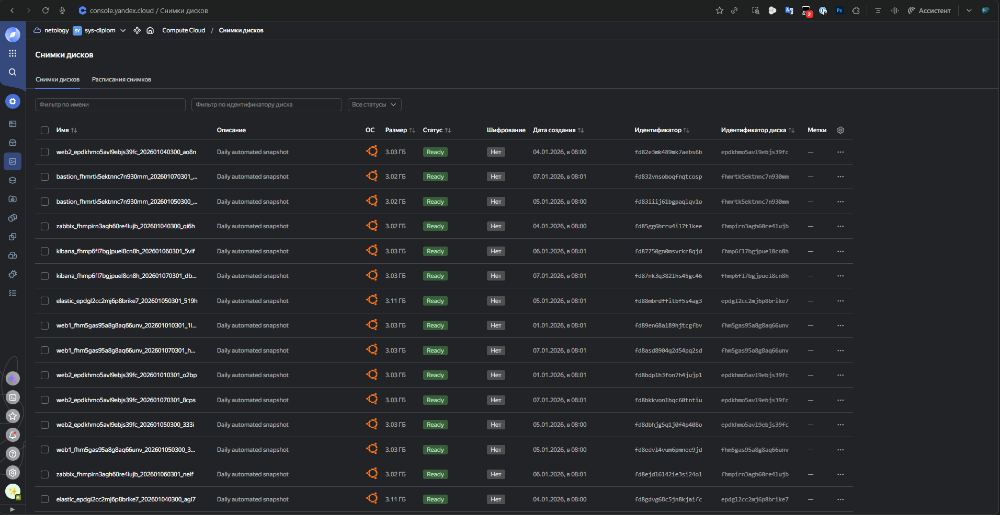
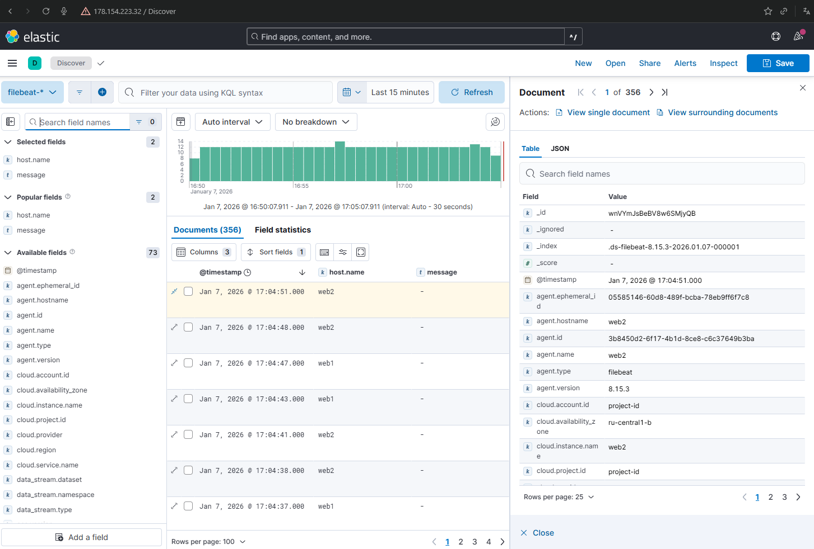

# Отказоустойчивая инфраструктура в Yandex Cloud

## Описание проекта

Данный проект представляет собой реализацию отказоустойчивой инфраструктуры для веб-сайта в облаке Yandex Cloud. Инфраструктура включает в себя веб-серверы с балансировкой нагрузки, систему мониторинга Zabbix, централизованный сбор логов через ELK Stack (Elasticsearch, Kibana), а также автоматическое резервное копирование.

## Архитектура решения

### Компоненты инфраструктуры

- **Веб-серверы**: 2 ВМ с Nginx в разных зонах доступности
- **Application Load Balancer**: Балансировщик нагрузки Yandex Cloud
- **Bastion Host**: Сервер-бастион для безопасного доступа к внутренним ресурсам
- **Zabbix Server**: Система мониторинга и алертинга
- **Elasticsearch**: Поисковая система для хранения логов
- **Kibana**: Веб-интерфейс для анализа логов
- **Filebeat**: Агент для сбора логов с веб-серверов

### Сетевая архитектура



```
┌─────────────────────────────────────────────────────────────┐
│                    Yandex Cloud VPC                         │
│                                                             │
│  ┌─────────────────┐  ┌─────────────────────────────────┐   │
│  │  Public Subnet  │  │        Private Subnets          │   │
│  │   10.0.1.0/24   │  │  Zone A: 10.0.10.0/24           │   │
│  │                 │  │  Zone B: 10.0.11.0/24           │   │
│  │  ┌───────────┐  │  │                                 │   │
│  │  │ Bastion   │  │  │  ┌─────────┐  ┌───────────────┐ │   │
│  │  │ Host      │  │  │  │  Web1   │  │ Elasticsearch │ │   │
│  │  └───────────┘  │  │  │ (Nginx) │  │               │ │   │
│  │                 │  │  └─────────┘  └───────────────┘ │   │
│  │  ┌───────────┐  │  │                                 │   │
│  │  │ Zabbix    │  │  │  ┌─────────┐                    │   │
│  │  │ Server    │  │  │  │  Web2   │                    │   │
│  │  └───────────┘  │  │  │ (Nginx) │                    │   │
│  │                 │  │  └─────────┘                    │   │
│  │  ┌───────────┐  │  │                                 │   │
│  │  │ Kibana    │  │  │                                 │   │
│  │  │ Server    │  │  │                                 │   │
│  │  └───────────┘  │  │                                 │   │
│  └─────────────────┘  └─────────────────────────────────┘   │
│                                                             │
│  ┌─────────────────────────────────────────────────────┐    │
│  │            Application Load Balancer                │    │
│  │                   (Public IP)                       │    │
│  └─────────────────────────────────────────────────────┘    │
└─────────────────────────────────────────────────────────────┘
```

## Технологический стек

### Infrastructure as Code

- **Terraform**: Управление инфраструктурой
- **Ansible**: Автоматизация конфигурации серверов

### Мониторинг и логирование

- **Zabbix 6.0**: Мониторинг системных метрик и алертинг
- **Elasticsearch**: Хранение и индексация логов
- **Kibana**: Визуализация и анализ логов
- **Filebeat**: Сбор логов с веб-серверов

### Веб-сервисы

- **Nginx**: Веб-сервер для статического контента
- **Application Load Balancer**: Балансировка нагрузки

## Структура проекта

```
.
├── terraform/                # Terraform конфигурации
│   ├── main.tf               # Основная конфигурация
│   ├── variables.tf          # Переменные
│   ├── outputs.tf            # Выходные значения
│   ├── instances.tf          # Конфигурация ВМ
│   ├── vpc.tf                # Сетевая конфигурация
│   ├── alb.tf                # Application Load Balancer
│   ├── security_groups.tf    # Группы безопасности
│   └── snapshots.tf          # Резервное копирование
├── ansible/                  # Ansible конфигурации
│   ├── inventories/          # Инвентори файлы
│   ├── playbooks/            # Playbook'и
│   ├── roles/                # Роли Ansible
│   └── group_vars/           # Групповые переменные
├── scripts/                  # Вспомогательные скрипты
└── webui/                    # Статические файлы сайта
```

## Быстрый старт

### Предварительные требования

1. **Yandex Cloud CLI** установлен и настроен
2. **Terraform** версии >= 1.5
3. **Ansible** версии >= 2.9
4. **SSH ключи** для доступа к ВМ

### Установка и развертывание

#### 1. Подготовка окружения

```bash
# Клонирование репозитория
git clone <repository-url>
cd yandex-cloud-infrastructure

# Создание файла с переменными Terraform
cp terraform/terraform.tfvars.example terraform/terraform.tfvars
```

#### 2. Настройка переменных

Отредактируйте `terraform/terraform.tfvars`:

```hcl
# Обязательные параметры
cloud_id     = "b1g..."           # ID облака
folder_id    = "b1g..."           # ID каталога
ssh_public_key = "ssh-ed25519 ..." # Публичный SSH ключ

# Опциональные параметры
environment = "prod"
project_name = "diploma"
vm_preemptible = true             # Для экономии (прерываемые ВМ)
```

#### 3. Развертывание инфраструктуры

```bash
# Инициализация Terraform
cd terraform
terraform init

# Планирование изменений
terraform plan

# Применение конфигурации
terraform apply
```



#### 4. Настройка серверов с Ansible

```bash
# Генерация инвентори файла
cd ..
./scripts/generate_inventory.sh

# Установка и настройка всех сервисов
cd ansible
ansible-playbook -i inventories/prod.yml playbooks/web.yml
ansible-playbook -i inventories/prod.yml playbooks/zabbix.yml
ansible-playbook -i inventories/prod.yml playbooks/elk.yml
```



## Конфигурация компонентов

### Веб-серверы (Nginx)

- **Расположение**: Приватные подсети в разных зонах
- **Конфигурация**: Статический контент, логирование
- **Мониторинг**: Zabbix агенты, Filebeat для логов

### Application Load Balancer

- **Target Group**: Включает оба веб-сервера
- **Health Check**: HTTP проверка на порт 80, путь "/"
- **Backend Group**: Настроен на Target Group
- **HTTP Router**: Маршрутизация трафика




#### Тест веб-сайта



### Система мониторинга (Zabbix)

- **Веб-интерфейс**: `http://<zabbix-ip>/zabbix`
- **Логин**: Admin / zabbix
- **Мониторинг**: CPU, RAM, диски, сеть, HTTP запросы
- **Алерты**: Настроены пороговые значения




### Система логирования (ELK)

- **Elasticsearch**: Хранение логов `http://<elastic-ip>:9200`
- **Kibana**: Веб-интерфейс `http://<kibana-ip>:5601`
- **Filebeat**: Сбор access.log и error.log с Nginx

### Безопасность

#### Security Groups

- **Bastion**: Только SSH (22) из интернета
- **Web серверы**: HTTP (80) от ALB, SSH от Bastion
- **Zabbix**: HTTP (80), Zabbix (10051) от агентов
- **Elasticsearch**: 9200 от Kibana и Filebeat
- **Kibana**: HTTP (5601) из интернета

#### Сетевая безопасность

- Веб-серверы и Elasticsearch в приватных подсетях
- Доступ к приватным ресурсам только через Bastion
- NAT Gateway для исходящего трафика

## Резервное копирование

### Автоматические снапшоты

- **Расписание**: Ежедневно в 00:00 UTC
- **Время хранения**: 7 дней
- **Охват**: Все диски ВМ



### Восстановление

```bash
# Список снапшотов
yc compute snapshot list

# Создание диска из снапшота
yc compute disk create --source-snapshot-id <snapshot-id> --name restored-disk

# Подключение диска к ВМ
yc compute instance attach-disk <instance-id> --disk-name restored-disk
```

## Мониторинг и алертинг

### Метрики Zabbix

#### Системные метрики (USE принцип)

**Utilization (Использование):**

- CPU utilization %
- Memory utilization %
- Disk space utilization %
- Network bandwidth utilization %

**Saturation (Насыщение):**

- CPU load average
- Memory swap usage
- Disk I/O wait time
- Network packet drops

**Errors (Ошибки):**

- System error logs
- Network interface errors
- Disk read/write errors
- HTTP 4xx/5xx responses

#### Веб-сервисы метрики

- HTTP response time
- HTTP status codes
- Nginx connections
- Request rate per second

### Дашборды

1. **System Overview**: Общий обзор всех серверов
2. **Web Servers**: Детальная информация по веб-серверам
3. **Network**: Сетевые метрики и трафик
4. **Application**: Метрики приложений и сервисов

## Логирование

### Сбор логов

**Nginx логи:**

- Access logs: `/var/log/nginx/access.log`
- Error logs: `/var/log/nginx/error.log`

**Системные логи:**

- Syslog: `/var/log/syslog`
- Auth logs: `/var/log/auth.log`

### Анализ в Kibana

1. **Веб-трафик**: Анализ HTTP запросов
2. **Ошибки**: Мониторинг ошибок 4xx/5xx
3. **Производительность**: Время ответа сервера
4. **Безопасность**: Анализ попыток входа



## Управление и обслуживание

### Полезные команды

#### Terraform

```bash
# Просмотр состояния
terraform show

# Получение выходных значений
terraform output

# Обновление инфраструктуры
terraform plan && terraform apply

# Уничтожение инфраструктуры
terraform destroy
```

#### Ansible

```bash
# Проверка доступности хостов
ansible all -i inventories/prod.yml -m ping

# Выполнение ad-hoc команд
ansible web -i inventories/prod.yml -m shell -a "systemctl status nginx"

# Обновление конфигурации
ansible-playbook -i inventories/prod.yml playbooks/web.yml --tags config
```

#### Мониторинг сервисов

```bash
# Проверка статуса всех сервисов
./scripts/service_status_report.sh

# Быстрая проверка сервисов
./scripts/quick_service_test.sh

# Диагностика проблем
./scripts/diagnose_services.sh
```

### Обновление системы

#### Обновление пакетов

```bash
# Обновление всех серверов
ansible all -i inventories/prod.yml -m apt -a "update_cache=yes upgrade=yes" --become

# Перезагрузка при необходимости
ansible all -i inventories/prod.yml -m reboot --become
```

#### Обновление конфигураций

```bash
# Обновление Nginx
ansible-playbook -i inventories/prod.yml playbooks/web.yml --tags nginx

# Обновление Zabbix
ansible-playbook -i inventories/prod.yml playbooks/zabbix.yml --tags config

# Обновление ELK
ansible-playbook -i inventories/prod.yml playbooks/elk.yml
```

## Масштабирование

### Горизонтальное масштабирование

1. **Добавление веб-серверов:**
   - Создание новых ВМ в Terraform
   - Добавление в Target Group ALB
   - Настройка через Ansible

2. **Масштабирование ELK:**
   - Добавление узлов Elasticsearch
   - Настройка кластера
   - Балансировка нагрузки

### Вертикальное масштабирование

```hcl
# В terraform/variables.tf
variable "web_cores" {
  default = 4  # Увеличение с 2 до 4 ядер
}

variable "web_memory" {
  default = 8  # Увеличение с 2 до 8 ГБ
}
```

## Безопасность

### Рекомендации по безопасности

1. **SSH ключи**: Используйте только ключи, никогда пароли
2. **Firewall**: Настройте Security Groups согласно принципу минимальных привилегий
3. **Обновления**: Регулярно обновляйте системы и пакеты
4. **Мониторинг**: Настройте алерты на подозрительную активность
5. **Резервные копии**: Регулярно проверяйте восстановление из бэкапов

### Аудит безопасности

```bash
# Проверка открытых портов
ansible all -i inventories/prod.yml -m shell -a "netstat -tlnp"

# Проверка активных пользователей
ansible all -i inventories/prod.yml -m shell -a "who"

# Анализ логов безопасности
ansible all -i inventories/prod.yml -m shell -a "tail -n 50 /var/log/auth.log"
```

## Устранение неполадок

### Частые проблемы

#### 1. Недоступность веб-сайта

```bash
# Проверка статуса ALB
yc alb load-balancer get <alb-id>

# Проверка Target Group
yc alb target-group get <tg-id>

# Проверка веб-серверов
ansible web -i inventories/prod.yml -m shell -a "systemctl status nginx"
```

#### 2. Проблемы с мониторингом

```bash
# Проверка Zabbix сервера
ssh ubuntu@<zabbix-ip> "systemctl status zabbix-server"

# Проверка агентов
ansible all -i inventories/prod.yml -m shell -a "systemctl status zabbix-agent2"

# Проверка подключения к серверу
ansible all -i inventories/prod.yml -m shell -a "zabbix_get -s localhost -k system.uptime"
```

#### 3. Проблемы с логированием

```bash
# Проверка Elasticsearch
curl -X GET "http://<elastic-ip>:9200/_cluster/health"

# Проверка Kibana
curl -X GET "http://<kibana-ip>:5601/api/status"

# Проверка Filebeat
ansible web -i inventories/prod.yml -m shell -a "systemctl status filebeat"
```

### Логи для диагностики

- **Terraform**: `terraform.log`
- **Ansible**: `/var/log/ansible.log`
- **Nginx**: `/var/log/nginx/error.log`
- **Zabbix**: `/var/log/zabbix/zabbix_server.log`
- **Elasticsearch**: `/var/log/elasticsearch/elasticsearch.log`

## Стоимость и оптимизация

### Экономия ресурсов

1. **Прерываемые ВМ**: Экономия до 70% стоимости
2. **Минимальные конфигурации**: 2 ядра 20%, 2-4 ГБ RAM
3. **Автоматическое выключение**: В нерабочее время (опционально)

### Мониторинг затрат

```bash
# Просмотр стоимости ресурсов
yc billing get-usage --service-id compute --folder-id <folder-id>

# Анализ использования дисков
yc compute disk list --format table
```

## Дополнительные возможности

### SSL/TLS сертификаты

```bash
# Создание сертификата через Certificate Manager
yc certificate-manager certificate request \
  --name website-cert \
  --domains example.com,www.example.com
```

### Instance Groups (автомасштабирование)

```hcl
resource "yandex_compute_instance_group" "web_group" {
  name = "web-instance-group"
  
  instance_template {
    # Конфигурация шаблона ВМ
  }
  
  scale_policy {
    auto_scale {
      min_zone_size = 1
      max_size      = 3
      initial_size  = 2
    }
  }
}
```

## Документация

- **Документация**: [Yandex Cloud Docs](https://cloud.yandex.ru/docs)
- **Terraform Provider**: [Yandex Cloud Terraform](https://registry.terraform.io/providers/yandex-cloud/yandex/latest/docs)
- **Ansible Collections**: [Yandex Cloud Ansible](https://galaxy.ansible.com/yandex/cloud)

---

**Примечание**: Данная инфраструктура предназначена для образовательных целей и демонстрации возможностей Yandex Cloud. Для production использования рекомендуется дополнительная настройка безопасности и мониторинга.
