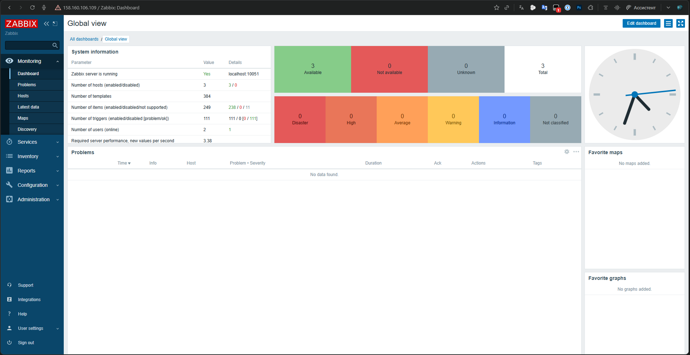
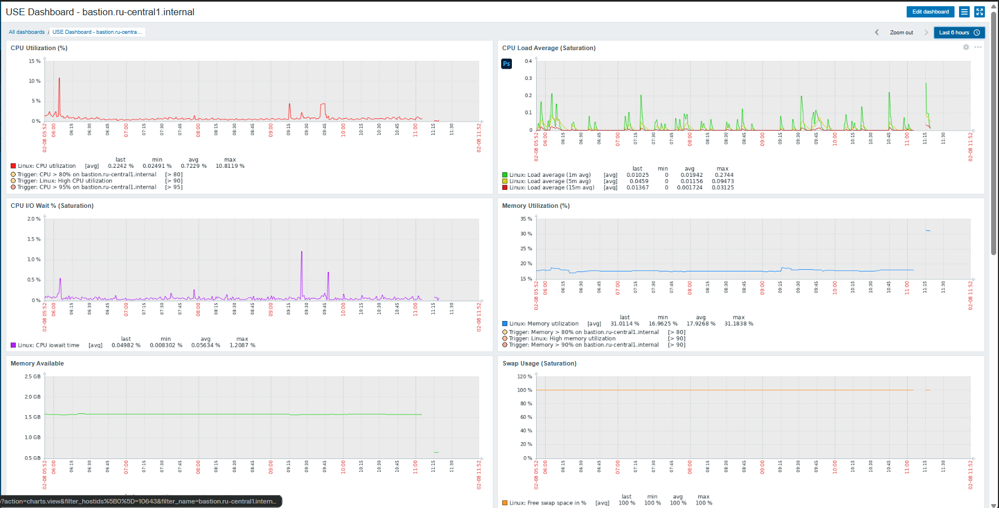
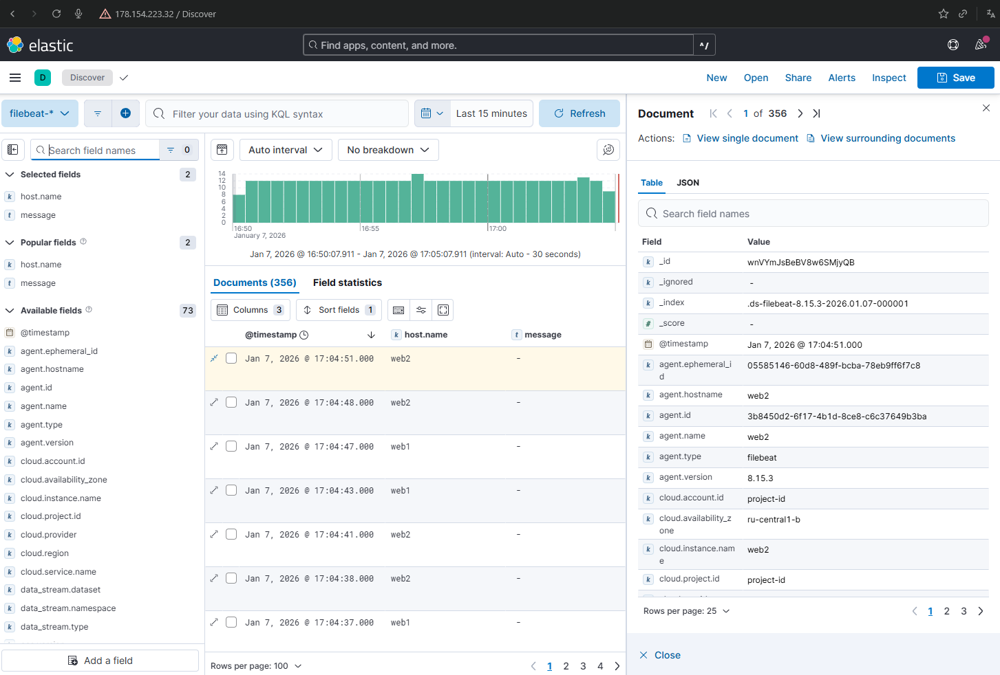
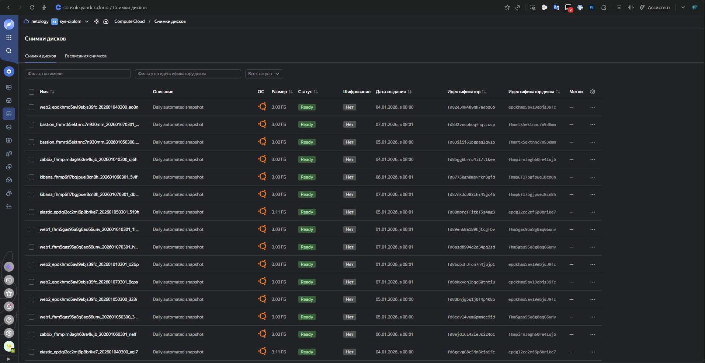
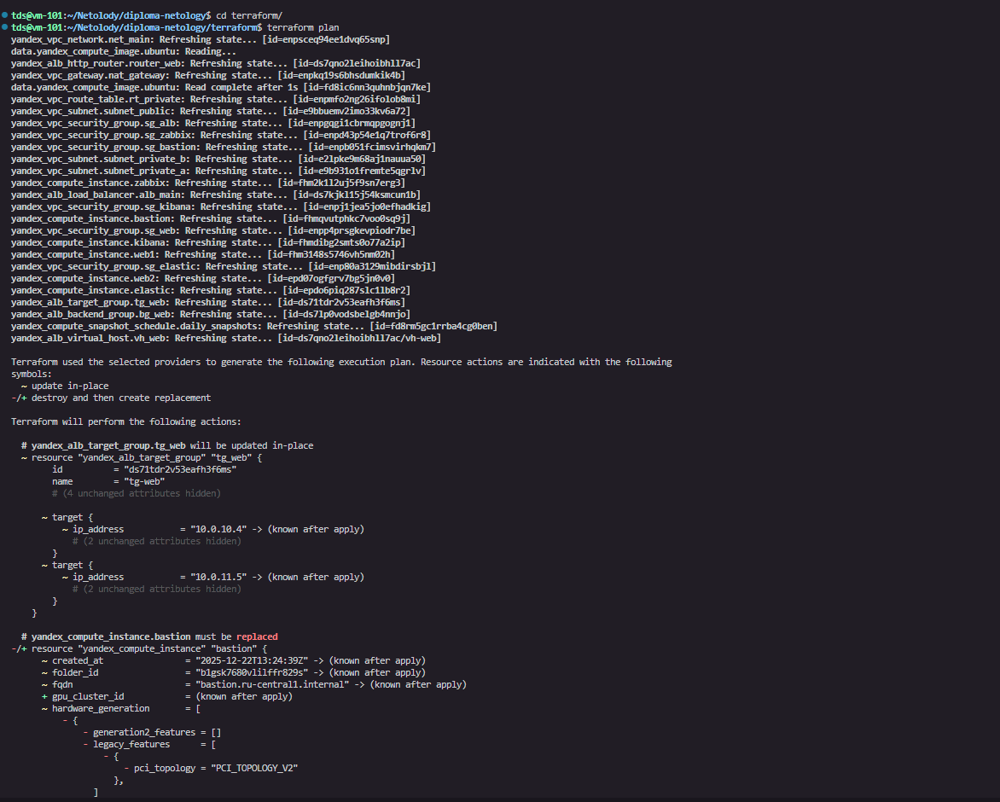
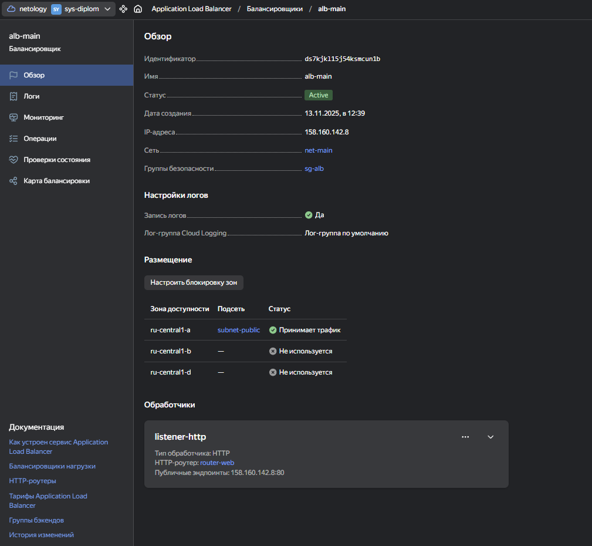
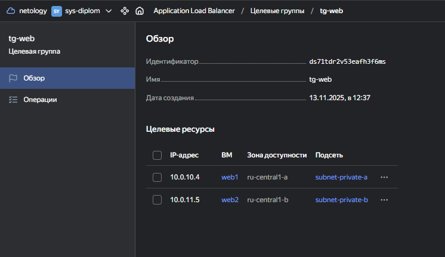
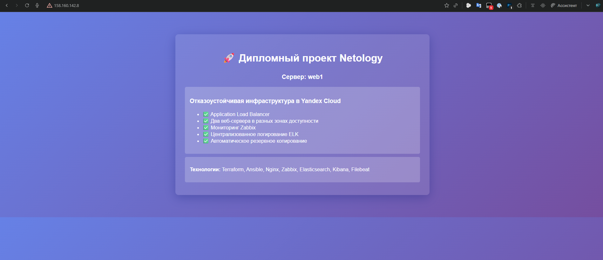
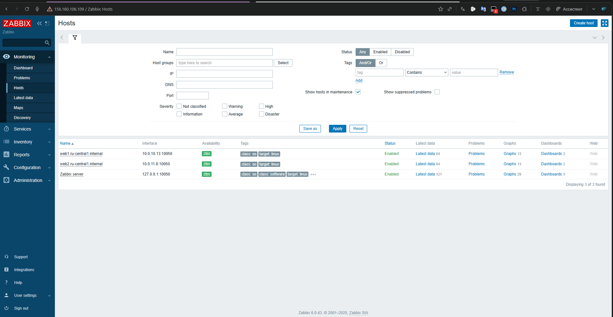

# Дипломная работа по профессии «Системный администратор»

## Задача

Разработать отказоустойчивую инфраструктуру для сайта в Yandex Cloud, включающую мониторинг, сбор логов и резервное копирование.

## Что сделано

Развернул полноценную инфраструктуру с помощью Terraform и Ansible:

- 2 веб-сервера с nginx в разных зонах доступности (для отказоустойчивости)
- Application Load Balancer для распределения нагрузки
- Zabbix для мониторинга всех серверов
- ELK стек (Elasticsearch + Kibana + Filebeat) для сбора и анализа логов
- Bastion host для безопасного доступа к внутренним серверам
- Автоматические снапшоты дисков раз в сутки

## Архитектура

```
                        ┌─────────────────────────────────────┐
                        │           Yandex Cloud              │
                        │                                     │
    Интернет ──────────►│  Application Load Balancer          │
                        │         (публичный IP)              │
                        │              │                      │
                        │     ┌────────┴────────┐             │
                        │     ▼                 ▼             │
                        │  ┌──────┐         ┌──────┐          │
                        │  │ Web1 │         │ Web2 │          │
                        │  │nginx │         │nginx │          │
                        │  └──────┘         └──────┘          │
                        │  zone-a           zone-b            │
                        │                                     │
                        │  ┌─────────┐  ┌─────────────────┐   │
                        │  │ Zabbix  │  │  Elasticsearch  │   │
                        │  │ Server  │  │    + Kibana     │   │
                        │  └─────────┘  └─────────────────┘   │
                        │                                     │
                        │  ┌─────────┐                        │
                        │  │ Bastion │◄──── SSH доступ        │
                        │  └─────────┘                        │
                        └─────────────────────────────────────┘
```

## Структура репозитория

```
├── terraform/          # Инфраструктура как код
│   ├── main.tf
│   ├── instances.tf    # Виртуальные машины
│   ├── vpc.tf          # Сеть и подсети
│   ├── alb.tf          # Балансировщик
│   ├── security_groups.tf
│   └── snapshots.tf    # Резервное копирование
│
├── ansible/            # Конфигурация серверов
│   ├── playbooks/
│   └── roles/
│       ├── nginx/
│       ├── zabbix-server/
│       ├── zabbix-agent/
│       ├── elasticsearch/
│       ├── kibana/
│       └── filebeat/
│
└── screenshots/        # Скриншоты для отчёта
```

## Сеть

Всё разнесено по подсетям:

| Подсеть | CIDR | Что там |
|---------|------|---------|
| Публичная | 10.0.1.0/24 | Bastion, Zabbix, Kibana |
| Приватная A | 10.0.10.0/24 | Web1 (zone-a) |
| Приватная B | 10.0.11.0/24 | Web2, Elasticsearch (zone-b) |

Веб-серверы и Elasticsearch без внешних IP — доступ только через bastion или балансировщик. Для выхода в интернет из приватных подсетей настроен NAT Gateway.

## Security Groups

Настроил минимально необходимые правила:

- **Bastion**: только SSH (22) снаружи
- **Web**: HTTP (80) от балансировщика, SSH от bastion
- **Zabbix**: HTTP (80), порт 10051 для агентов
- **Elasticsearch**: 9200 только от Kibana и веб-серверов
- **Kibana**: 5601 снаружи

## Мониторинг

Zabbix собирает метрики со всех серверов по принципу USE:
- CPU, память, диски, сеть
- Статус nginx на веб-серверах



## Логи

Filebeat на веб-серверах отправляет access.log и error.log nginx в Elasticsearch. Смотреть можно в Kibana.



## Резервное копирование

Снапшоты всех дисков делаются автоматически каждый день в 3:00 UTC. Хранятся 7 дней.



## Как развернуть

1. Скопировать `terraform/terraform.tfvars.example` в `terraform/terraform.tfvars` и заполнить свои данные
2. `cd terraform && terraform init && terraform apply`
3. Скопировать `ansible/inventories/prod.yml.example` в `ansible/inventories/prod.yml` и подставить IP из terraform output
4. `cd ansible && ansible-playbook -i inventories/prod.yml playbooks/site.yml`

## Доступы для проверки

| Сервис | URL | Логин/пароль |
|--------|-----|--------------|
| Сайт | http://158.160.142.8 | — |
| Zabbix | http://93.77.176.179/zabbix | Admin / zabbix |
| Kibana | http://51.250.2.184:5601 | — |

## Скриншоты

### Инфраструктура


### Балансировщик



### Сайт


### Мониторинг

